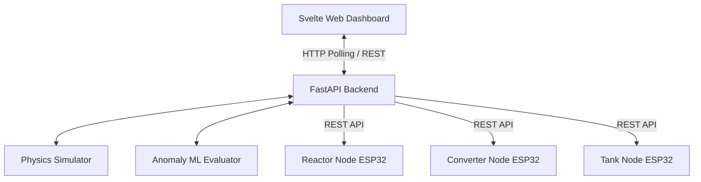

# Intelligent Plant Monitor 🏭

A real-time industrial plant simulation and anomaly detection dashboard. This system generates dynamic telemetry data, analyzes it using a mock Machine Learning model, and provides a polished interface to inject and monitor failures (like Reactor Overheating or Tank Overflow).

## 🌟 Features

- **Real-Time Physics Simulation:** Generates continuous, realistic noise for Reactor Temperature, Pressure, Gas Flow, and Tank Level.
- **Machine Learning Anomaly Detection:** Actively evaluates trends against safe operational boundaries to flag warnings before critical failure.
- **Dynamic ESP32 Integration:** Pre-configured endpoints allow IoT microcontrollers (like ESP32/NodeMCU) to pull live Warning/Critical states and messages directly to their LED indicators and LCD screens.
- **Premium Dark Mode UI:** Built with Svelte, featuring glassmorphism elements, neon severity indicators, and live metrics charting.

## 🏗️ Architecture



## 🛠️ Tech Stack
* **Frontend:** Svelte (Vite), Svelte-ChartJS, Chart.js, Lucide Svelte (Icons), Vanilla CSS
* **Backend:** Python, FastAPI, Uvicorn, Asyncio

---

## 🚀 Getting Started

The project is completely localized and split into a client-server architecture. You will need two terminal windows to run both simultaneously.

### 1. Start the FastAPI Backend
The backend engine handles the data generation and handles the anomaly API calls.

```bash
cd backend
# 1. Create a virtual environment
python3 -m venv venv
# 2. Activate the virtual environment
source venv/bin/activate
# 3. Install required libraries
pip install -r requirements.txt
# 4. Boot the server on Port 8000
uvicorn main:app --reload --host 0.0.0.0 --port 8000
```
*The backend API will be running at `http://0.0.0.0:8000`*

### 2. Start the Svelte Frontend
The dashboard simply fetches the computed state from the backend.

```bash
cd ..  # Make sure you are in the root directory
# 1. Install dependencies (if you haven't)
npm install
# 2. Start the development server
npm run dev
```
*The web UI will be accessible locally, typically at `http://localhost:5173`*

---

## 📡 ESP32 Hardware Integration

The system exposes REST API endpoints explicitly formatted for your ESP32 boards to poll. 
For example, to have your Reactor ESP32 pull its current LED status and LCD message, simply run an HTTP GET request to:
`http://<SERVER_IP>:8000/esp32/reactor/status`

**Response Example:**
```json
{
  "node": "reactor",
  "status": "WARNING",
  "message": "WARNING:\nReactor Temp Rising"
}
```

*Available Nodes:* `reactor`, `converter`, `tank`.

---

## 🎭 Simulation Workflow

1. **Normal Operation:** All values hover in safe limits. The ESP Nodes read `NORMAL`.
2. **Inject Anomaly:** Press **"Inject Reactor Overheating"** on the Dashboard.
3. **Escalation:** The physics engine accelerates the heat over several ticks. 
4. **Warning Threshold:** The ML model catches the rising trend early (e.g. at 385°C), updating UI to yellow, providing a generated reason (e.g., *Cooling system failure*).
5. **Critical Threshold:** Left unchecked past 420°C, the system triggers the `CRITICAL` state, triggering red visuals and advising an immediate emergency shutdown.
# sulphuric_acid_p_simulation
